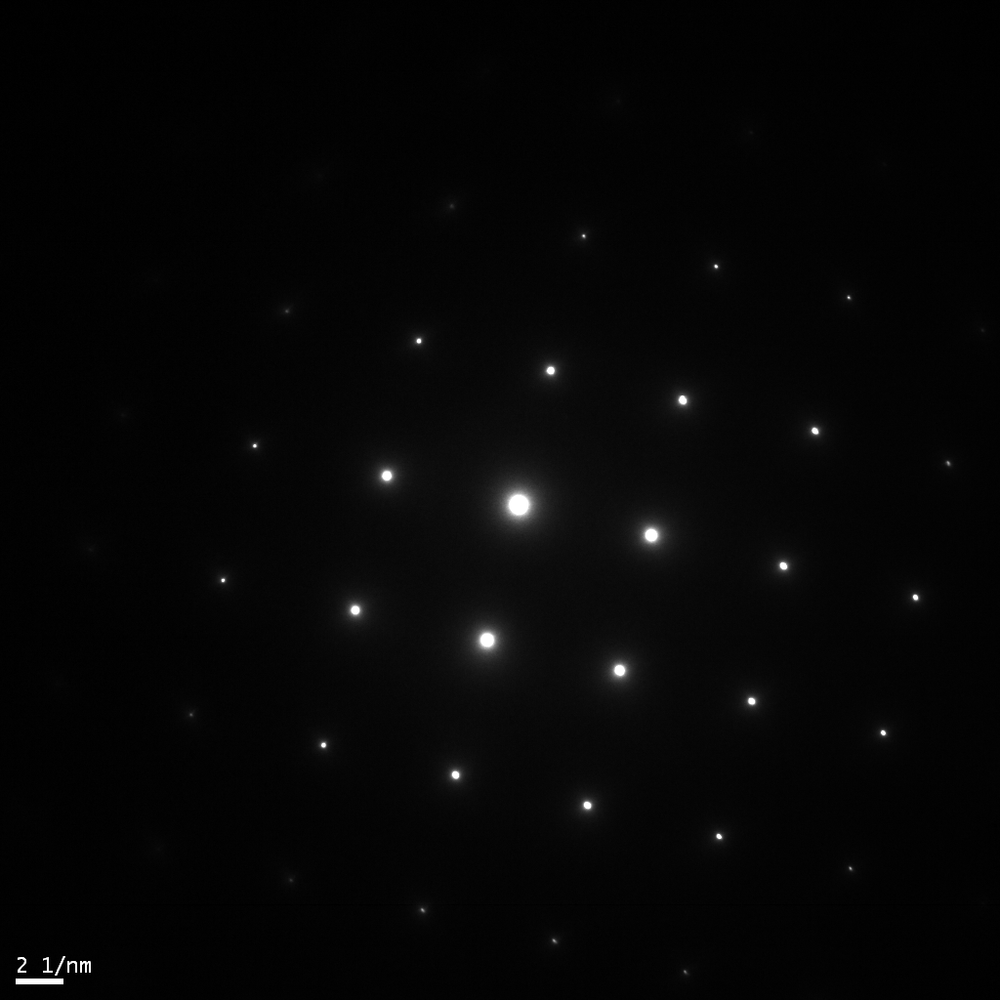
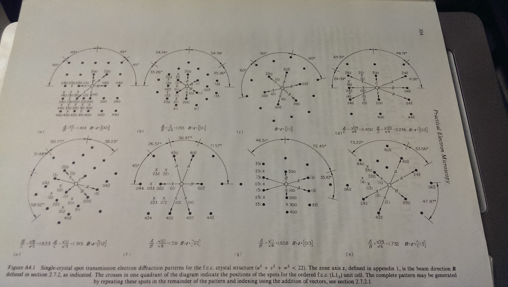

As someone who likes computers and programming, I've been interested in making a
personal site for some time, but was never really happy with the options that
were available. I didn't want to just buy some template that someone else had
made and fill in some boxes with text, but rather understand the whole process
of how computers talk to each other.

Previously, I had tried a static site generator (Jekyll) before, but that felt
relatively limited and left me with some open questions, like how does HTML and
CSS work and what do I do if I want dynamic content? I had also tried
fruitlessly for a while to make a NextJS app, which has what seems like a great
combination of static site generation as well as responsive/React-like
components. This ended up being too complicated. To someone with no web dev
experience, Javascript and diving into the deep end w/ a React-like framework
was just too difficult.

Much of my day job as a researcher is spent using Python, and I'm pretty
comfortable in the language. For this reason, for the latest (current) attempt,
I decided to go with [Flask](https://flask.palletsprojects.com/en/2.2.x/), a
Python based framework for the web. It is described as "lighter" than the other
main Python framework, Django, and therefore I hoped it would be simpler. It has
the ability to turn Markdown files into blog pages, but also run Python code in
the backend, which was a requirement for what I wanted the site to be able to
do. With the main framework decided, I started pieceing together different blog
posts and tutorials, in order to begin to make my site.

My goals were initially simple, and fairly naive. I wanted to have a home page,
an about page with a description about myself, a blog section, with posts,
including tags and dates, and a section for simulating TEM selected area
diffraction patterns.

<figure>

<figcaption> <b>Fig. 1</b> An experimental zone axis diffraction pattern used to determine orientation. </figcaption>
</figure>

The simulation of diffraction patterns was key - there used to be a website
called TEMMaps (I think) that was invaluable to me as a graduate student. Often,
when you're at the electron microscope, you have a crystalline sample inserted,
and you want to know what orientation you are in -- essentially, what direction
are you looking at in the crystal? The most common way of determining this is to
take a
[diffraction pattern](https://en.wikipedia.org/wiki/Selected_area_diffraction).
However, you have index the diffraction pattern, i.e. calculate or compare to
tabulated values the location of the various peaks in your image to determine
which of the orientations, or zone axes, you are at. Some of these patterns are
tabulated, an image can be seen below, but TEMMaps gave you the opportunity to
just type in a crystal structure, an orientation, and it would simulate the
diffraction pattern. By simply comparing to what you had on the microscope
screen or camera in front of you, you could quickly determine if you were in the
right zone axis.

<figure>

<figcaption> <b>Fig. 1</b> A picture from the best resource for diffraction pattern matching: <em>Practical Electron Microscopy in Materials Science</em>, by J. W. Edington. (Right-click and open in new tab/window to enlarge.) </figcaption>
</figure>

However, this site was shut down about 5 years ago, and I have never found a
good replacement for quick, reliable diffraction pattern simulations to be used
while you were operating the microscope. Other tools exist - there is a whole
family of paid and open source software simply for crystallography, but they
require either expensive licenses, or to work in Python or Matlab, which is
often a pain to set up while you're trying to figure out what is going on in the
microscope. They also are much more complex than what is needed in the moment -
all you want is a picture to compare with, not the whole wealth of information
that the other tools can provide, not to mention you need to find the correct
input file that accurately represents your crystal system.

The goal was therefore to make this much simpler, and bring back what TEMMaps
had provided, with some enhancenments. It would utilize
[py4DSTEM](https://github.com/py4dstem/py4DSTEM) to download any material that
is in the [Materials Project Database](https://materialsproject.org/materials)
and simulate a diffraction pattern from a defined orientation. The results, both
what the crystal looks like in real space, as well as the diffraction pattern in
reciprocal space, would be shown. With that in mind, the site was started.
